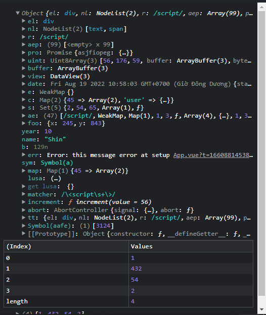

# vue-console-feed

[](https://github.com/tachibana-shin/vue-console-feed/actions/workflows/test.yml)
[](http://badge.fury.io/js/vue-console-feed)
[](https://npmjs.org/package/vue-console-feed)
[](https://npmjs.org/package/vue-console-feed)
[](https://npmjs.org/package/vue-console-feed)
[](https://github.com/tachibana-shin/vue-console-feed/stargazers)
[](https://npmjs.org/package/vue-console-feed)

This is the plugin that is almost identical to the [console-feed](https://github.com/samdenty/console-feed) but for Vue. This plugin moves closer to `Console Chrome Devtools` than `console-feed`

> [Demo from Stackbliz](https://stackblitz.com/edit/github-m6j4xf)

**This plugin release!**

## Preview



## Installation

pnpm, yarn, npm:

```bash
pnpm add vue-console-feed
```

or with CDN:

```html
<link rel="stylesheet" href="https://cdn.skypack.dev/vue-console-feed/style.css">
<script type="module">
  import * as ConsoleFeed from "https://cdn.skypack.dev/vue-console-feed"
</script>
```

## To be on

- [x] basic type value (string, number, bigint, symbol, null, undefined) `full support`
- [x] error `full support`
- [x] object `full support`
- [x] array `full support`
- [x] Map, Set, WeakMap, WeakSet `full support`
- [x] function, function full `full support`
- [x] function async
- [x] function star, prop
- [x] regexp `full support`
- [x] element, DOM `full support`
- [x] Promise `limit`
- [x] console.table
- [x] console.warn
- [x] console.info
- [x] console.error
- [x] console.count
- [x] console.group
- [x] Date
- [x] Buffer
- [x] TypedArray
- [x] DataView
- [x] address `http` in `string` and `Error`
- [x] Location link

**DataAPI**

- [x] console.log
- [x] console.warn
- [x] console.info
- [x] console.debug
- [x] console.error
- [x] console.table
- [x] console.group
- [x] console.groupEnd
- [x] console.count
- [x] console.countReset
- [x] console.time
- [x] console.timeLog
- [x] console.timeEnd
- [x] console.clear

## Usage

### Console & DataAPI

```vue
<template>
  <Console :data="console.value" />
</template>

<script lang="ts" setup>
import { Console, DataAPI } from "vue-console-feed"
import "vue-console-feed/style.css"

const console = new DataAPI(false, 0) // if you use API set option to true, argument 2 offset deep location

console.log("hello world")
console.count()
console.group()
console.count()
console.table([1, 234, 1])
console.warn("Warning!!")
console.count()
console.groupEnd()
</script>
```

### ConsoleItem

| Option                | Type                                                          | Required | Description                                                                                                     |
| --------------------- | ------------------------------------------------------------- | -------- | --------------------------------------------------------------------------------------------------------------- |
| `type`                | `"warn" \| "info" \| "debug" \| "error" \| "output" \| "log"` | `false`  | determine the console type corresponding to the methods `data.warn`, `console.info`, `data.debug`, `data.error` |
| `data`                | `ReturnType<typeof Encode>`                                   | `true`   | determine the type corresponding to the methods `Encode`                                                        |
| `_getListLinkAsync`   | `Promisy<_getListLink>`                                       | `false`  | This is the `promise` function of `_getListLink`                                                                |
| `readLinkObjectAsync` | `Promisy<readLinkObject>`                                     | `false`  | This is the `promise` function of `readLinkObject`                                                              |

#### Example and Promise API

```vue
<template>
  <ConsoleItem :data="data" type="log" />
</template>

<script lang="ts" setup>
import { ConsoleItem, Encode } from "vue-console-feed"
import "vue-console-feed/style.css"

const data = Encode(
  {
    name: "Shin",
    permission: ["admin"],
    social: {
      twitter: "@tachib_shin",
      github: "@tachibana-shin"
    }
  },
  true,
  true
)
</script>
```

You have custom API fetch lazy data

> Options `_getListLinkAsync` and `readLinkObjectAsync` is the port of the functions corresponding to it. useful when you work with iframe.

> In it `_getListLinkAsync` is the `promise` function of `_getListLink` and `readLinkObjectAsync` is the `promise` function of `readLinkObject`.

```vue
<template>
  <ConsoleItem
    :data="data"
    :_getListLinkAsync="_getListLinkAsync"
    :readLinkObjectAsync="readLinkObjectAsync"
  />
</template>

<script lang="ts" setup>
import {
  ConsoleItem,
  Encode,
  _getListLink,
  readLinkObject
} from "vue-console-feed"
import "vue-console-feed/style.css"

const data = Encode(
  {
    name: "Shin",
    permission: ["admin"],
    social: {
      twitter: "@tachib_shin",
      github: "@tachibana-shin"
    }
  },
  true,
  true
)

// custom api
async function _getListLinkAsync(link: Data.Link) {
  return _getListLink(link)
}
async function readLinkObjectAsync(link: Data.Link) {
  return readLinkObject(link)
}
</script>
```

### ConsoleTable

| Option                | Type                       | Required | Description                                             |
| --------------------- | -------------------------- | -------- | ------------------------------------------------------- |
| `data`                | `ReturnType<typeof Table>` | `true`   | determine the type corresponding to the methods `Table` |
| `_getListLinkAsync`   | `Promisy<_getListLink>`    | `false`  | This is the `promise` function of `_getListLink`        |
| `readLinkObjectAsync` | `Promisy<readLinkObject>`  | `false`  | This is the `promise` function of `readLinkObject`      |

#### Example and Promise API

```vue
<template>
  <ConsoleTable :data="data" type="log" />
</template>

<script lang="ts" setup>
import { ConsoleTable, Encode, Table } from "vue-console-feed"
import "vue-console-feed/style.css"

const value = {
  name: "Shin",
  permission: ["admin"],
  social: {
    twitter: "@tachib_shin",
    github: "@tachibana-shin"
  }
}
const data = Table(value)
</script>
```

You have custom API fetch lazy data

> Options `_getListLinkAsync` and `readLinkObjectAsync` is the port of the functions corresponding to it. useful when you work with iframe.

> In it `_getListLinkAsync` is the `promise` function of `_getListLink` and `readLinkObjectAsync` is the `promise` function of `readLinkObject`.

```vue
<template>
  <ConsoleTable
    :data="data"
    :_getListLinkAsync="_getListLinkAsync"
    :readLinkObjectAsync="readLinkObjectAsync"
  />
</template>

<script lang="ts" setup>
import {
  ConsoleTable,
  Encode,
  Table,
  _getListLink,
  readLinkObject
} from "vue-console-feed"
import "vue-console-feed/style.css"

const value = {
  name: "Shin",
  permission: ["admin"],
  social: {
    twitter: "@tachib_shin",
    github: "@tachibana-shin"
  }
}
const data = Table(value)

// custom api
async function _getListLinkAsync(link: Data.Link) {
  return _getListLink(link)
}
async function readLinkObjectAsync(link: Data.Link) {
  return readLinkObject(link)
}
</script>
```

### API

#### Encode(value: unknown, firstCall: boolean, linkFn: boolean)

Encrypt the values for use on the components (the result of this function is a pure object so you can use `JSON.stringify`, send `fetch` or `postMessage` it which remains safe for data.
Option | Type | Required | Description
------ | ---- | -------- | ------------
`value` | unknown | `true` | value for encryption. accept all kinds of values like `data.log`
`firstCall` | `boolean` | `true` | Is this your root data? If you don't care about it, always set it to `true`.
`linkFn` | `boolean` | `true` | Is this link object? If you don't care about it, always set it to `true`.

```ts
function Encode(
  value: unknown,
  firstCall?: boolean,
  linkFn?: boolean
):
  | Data.String
  | Data.Number
  | Data.BigInt
  | Data.Symbol
  | Data.Function
  | Data.Collection
  | Data.RegExp
  | Data.Nill
  | Data.Record
  | Data.Error
  | Data.Array
  | Data.Element
  | Data.Promise
  | Data.Date
  | Data.TypedArray
  | Data.Buffer
  | Data.DataView
```

#### Table(value: object)

Encrypt the values for use on the components (the result of this function is a pure object so you can use `JSON.stringify`, send `fetch` or `postMessage` it which remains safe for data.
Option | Type | Required | Description
----- | ----- | ----- | -----------
`value` | like `object` | `true` | It could be anything in the form of an object to encrypt.

```ts
function Table(value: object): {
   table: Record<string, Record<string, Data.String | Data.Number | Data.BigInt | Data.Symbol | Data.Nill | DataPreview.Record | ... 10 more ... | DataPreview.DataView>>;
   cols: string[];
}
```

#### readLinkObject(link: Data.Link), \_getListLink(link: Data.Link)

These are the system functions for communication between different environments. (Exm: `fetch`, `postMessage`)
If you don't use other environments, you should ignore this.

```ts
function readLinkObject(link: Data.Link): Data.String | Data.Number | Data.BigInt | Data.Symbol | Data.Nill | Data.Function | Data.Collection | Data.Record | ... 8 more ... | Data.DataView
function _getListLink(link: Data.Link): (ReturnType<typeof Encode> | Data.Error)[]
```

#### clearLinkStore()

This is the memory release function. while you call the `Encode` functions, there will be some `object in object`, but the objects in are not immediately used so `Encode` will not analyze it but create a `link` by clicking on `object in object` that the `_getLinkObject` function will work to parse it
